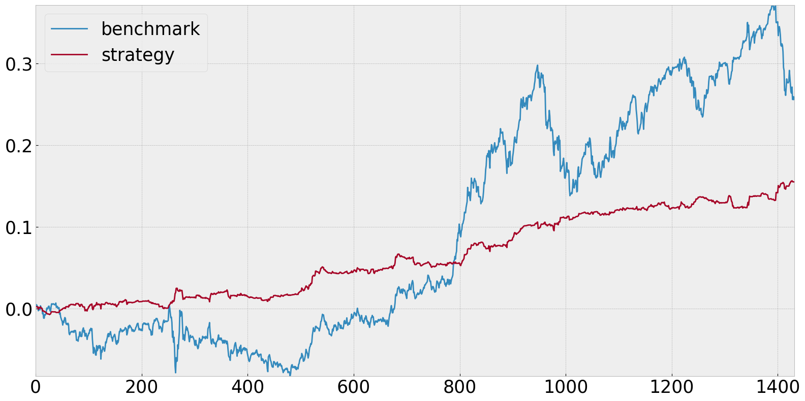
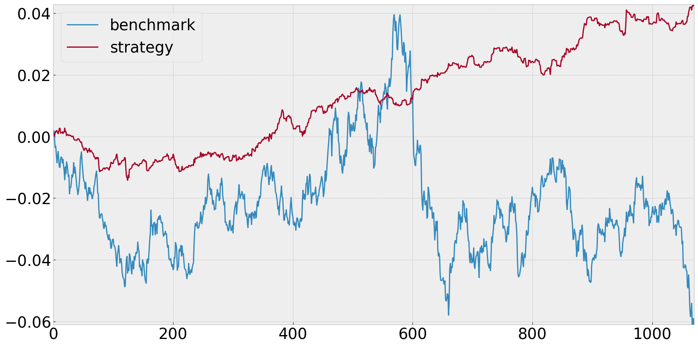
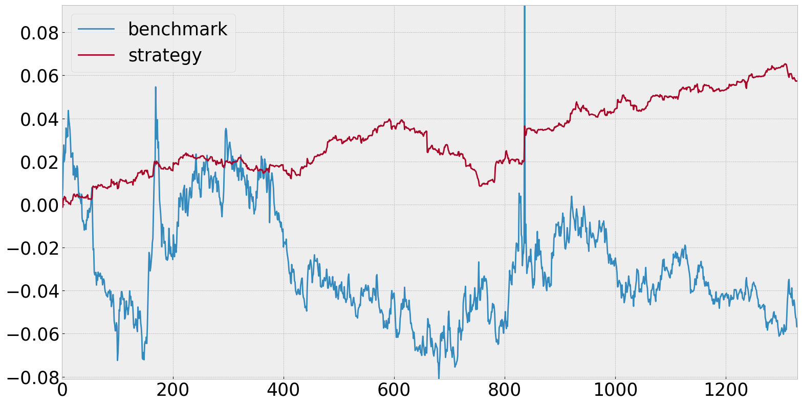

# Representation Learning for Financial Time-Series Forecasting


## Table of Contents
- [Introduction](#introduction)
- [Features](#features)
- [Installation](#installation)
- [Contents](#contents)
- [Results](#results)

## Introduction

This repository contains the implementation of my MSc project titled **Representation Learning for Financial Time-Series Forecasting**. The primary goal of this project is to enhance the accuracy of financial time-series forecasting by leveraging **Contrastive Predictive Coding (CPC)** to generate feature embeddings.

## Features

- **Contrastive Predictive Coding (CPC)**: Utilised for feature extraction from financial time series, improving downstream model performance.
- **Baseline Models**: Includes Persistence, Zero, Mean, Linear Regression and Buy-and-Hold models for performance benchmarking.
- **LSTM Model Implementation**: For comparison with CPC-enhanced models.
- **Sharpe Ratio Optimization**: Evaluates model performance using Sharpe ratios.

## Installation

To get started with this project, clone the repository and set up the environment using `conda` and `pip`.

### Step 1: Clone the Repository

```bash
git clone https://github.com/ese-msc-2023/irp-agk123.git
cd irp-agk123
```

### Step 2: Set Up the Conda Environment
Create a new Conda environment using the provided environment.yml file (note the environment is mac users on arm architecture who require tensorflow-macos):

```bash
conda env create -f environment.yml
conda activate cpc_financial
```

## Contents

- **deliverables**: Deliverables for my project. Inlcudes the project plan, final report and presentation.
- **images**: Images utilised in the deliverables.
- **other_notebooks**: Tried and failed attempts and different approaches.
- **src**: Where the main notebook lives. Utils folder with utils functions.
- **tests**: Tests for my utility functions and CPC data generator that are automatically run through the CI github action.

## Results
The below results all beat the classic benchmark of buy-and-hold. For more details, visit the [CPC notebook](src/cpc_final.ipynb).

### USDJPY: Sharpe of 1.3 versus 0.53 using Buy-and-Hold Benchmark


### USDSGD: Sharpe of 0.98 versus -0.35 using Buy-and-Hold Benchmark


### EURGBP: Sharpe of 0.74 versus -0.12 using Buy-and-Hold Benchmark
